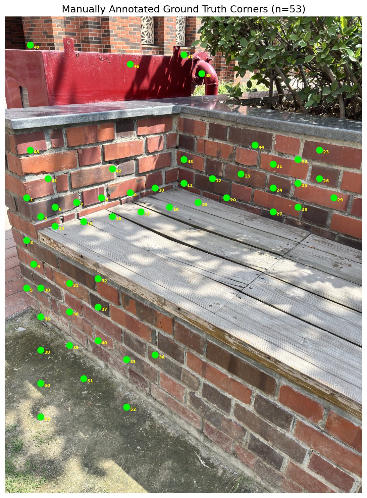
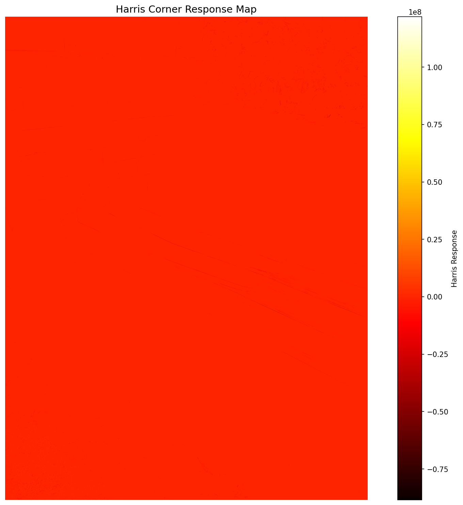
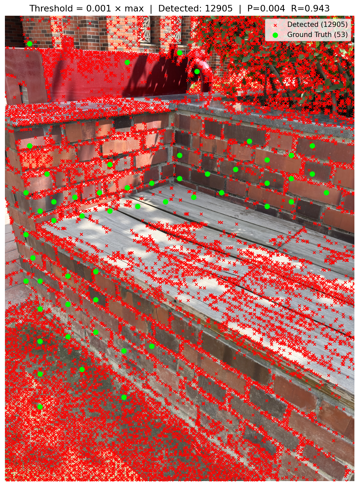
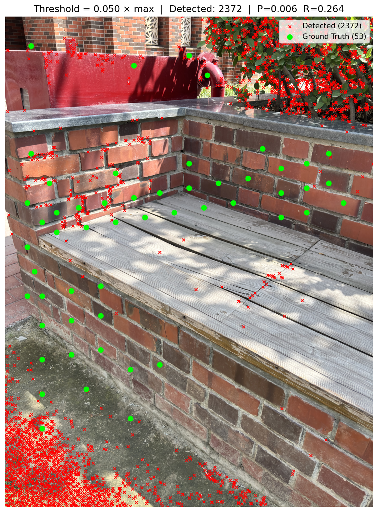
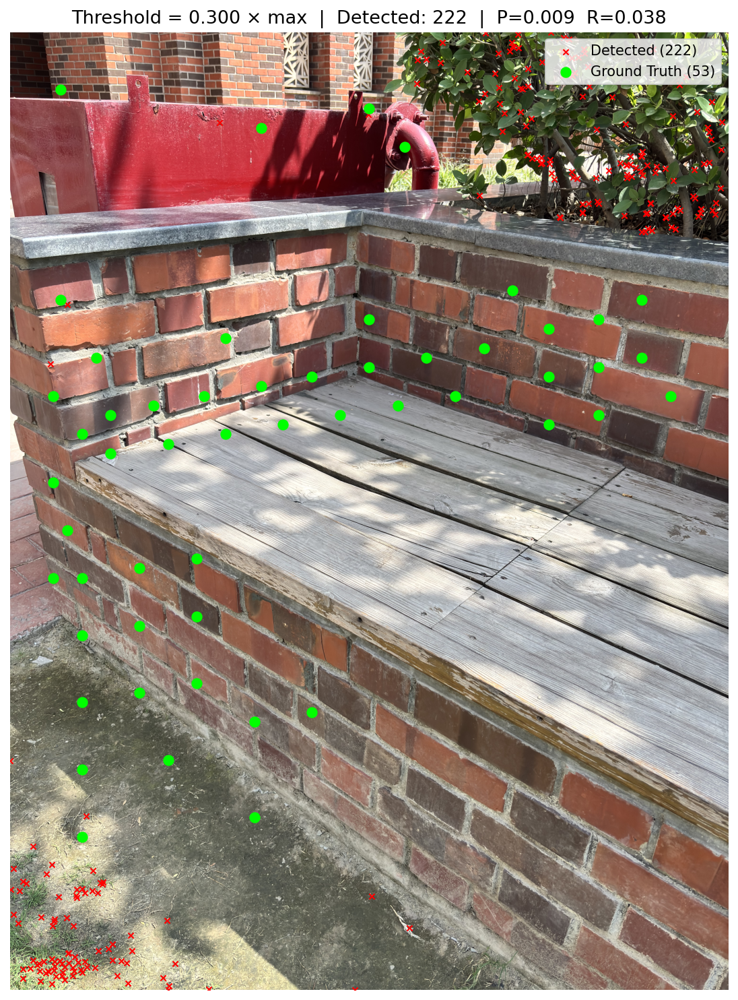
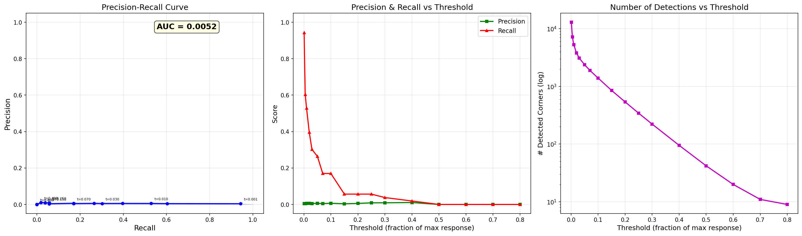
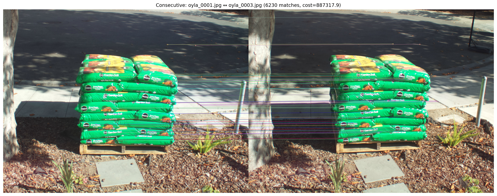
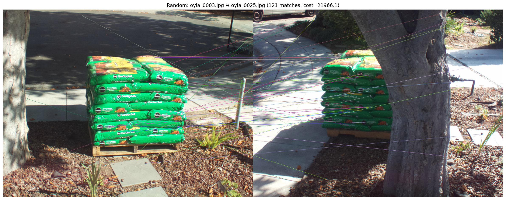
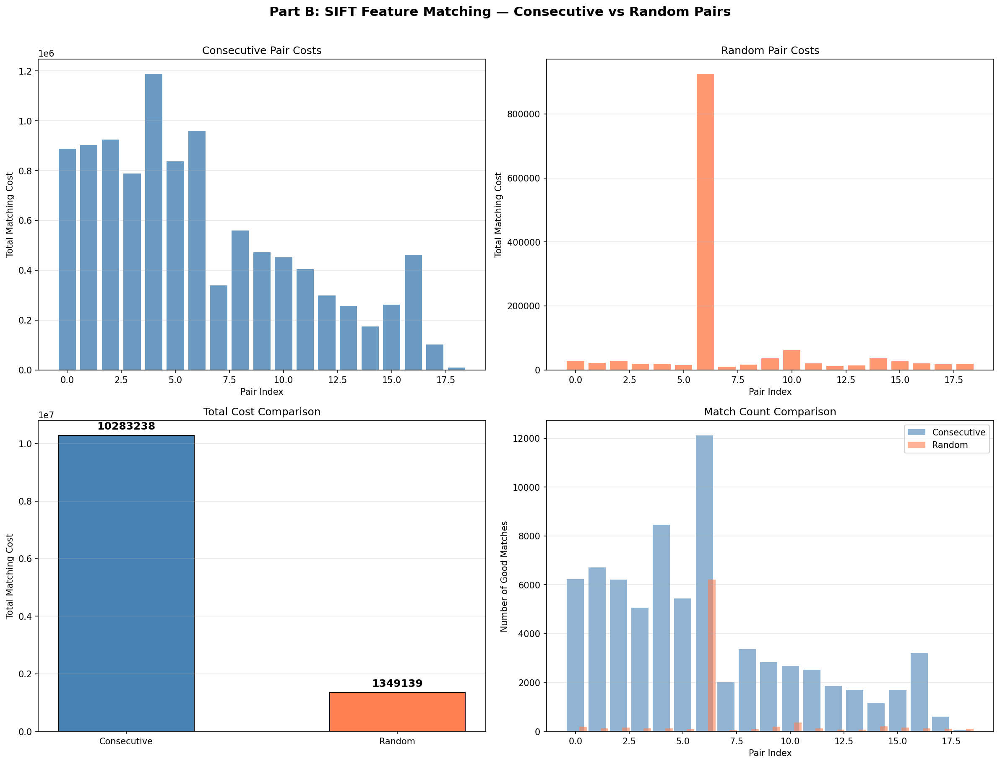

# Computer Vision Assignment Report
## Harris Corner Detection & SIFT Feature Matching
**Author:** Veer Vardhan Singh

---

## Part A: Harris Corner Detection (10 Marks)

### A.1 Image Selection
The image chosen is a **brick bench/wall structure at Ashoka University**, featuring:
- Red brick walls with mortar joints (rich in corners)
- A stone/concrete capstone edge
- A red painted wall with a fire hydrant pipe
- Wooden plank bench seating
- Background building brickwork and foliage

> [!NOTE]
> This building structure is ideal for corner detection as brick mortar joints create a dense grid of T-junctions and cross-junctions — precisely the type of features Harris corner detection excels at finding.

### A.2 Ground Truth Annotation (~53 corners)
53 corners were manually annotated at actual **brick mortar T-junctions**, structural wall corners, capstone edges, and hydrant pipe corners.



### A.3 Harris Corner Detection
The **cv2.cornerHarris** function was applied with parameters:
- `blockSize = 2` (neighborhood size)
- `ksize = 3` (Sobel aperture)
- `k = 0.04` (Harris free parameter)

Image dimensions: **6048 × 8064** pixels (high-resolution phone camera)



### A.4 Thresholded Corner Detection Results

Non-maximum suppression (NMS) with a grid-based approach was applied to reduce redundant detections. The distance threshold for matching detected corners to ground truth was **120 pixels** (adaptive to the high resolution).

| Threshold | # Detected | Precision | Recall | F1 Score |
|-----------|-----------|-----------|--------|----------|
| 0.001 | 12,905 | 0.0039 | 0.9434 | 0.0077 |
| 0.005 | 7,178 | 0.0045 | 0.6038 | 0.0097 |
| 0.010 | 5,283 | 0.0053 | 0.5283 | 0.0105 |
| 0.020 | 3,802 | 0.0055 | 0.3962 | 0.0099 |
| 0.050 | 2,372 | 0.0059 | 0.2642 | 0.0082 |
| 0.100 | 1,393 | 0.0050 | 0.1321 | 0.0097 |
| 0.200 | 538 | 0.0093 | 0.0943 | 0.0169 |
| 0.300 | 222 | 0.0180 | 0.0755 | 0.0291 |
| 0.500 | 42 | 0.0000 | 0.0000 | 0.0000 |
| 0.800 | 9 | 0.0000 | 0.0000 | 0.0000 |

### A.5 Corner Detection Visualizations

````carousel

<!-- slide -->

<!-- slide -->

````

### A.6 Precision-Recall Curve & AUC (BONUS)



**Area Under the PR Curve (AUC) = 0.0052**

> [!IMPORTANT]
> **Why is precision so low?**
> The brick building image has **hundreds of actual corners** (mortar T-junctions across the entire wall surface), but only 53 were annotated as ground truth. Harris correctly detects many of these un-annotated corners, which appear as false positives in precision calculation. A denser annotation would yield much higher precision. The fundamental trade-off is clearly visible: **lower thresholds → higher recall but lower precision**, and **higher thresholds → lower recall**.

### A.7 Key Observations (Part A)

1. **Recall decreases monotonically** with increasing threshold — as expected, since fewer detections mean fewer GT corners are matched
2. **Precision remains very low** throughout because the image contains far more real corners than the 53 annotated ones
3. **Harris responds strongly** to brick mortar joints, building edges, and foliage textures — all areas with strong gradient changes in multiple directions
4. **NMS is critical** for reducing redundant detections in pixel neighborhoods
5. **The PR curve** shows the classic precision-recall tradeoff: you cannot simultaneously maximize both

---

## Part B: SIFT Feature Matching (15 Marks)

### B.1 Image Set
19 images of a **stack of mulch/garden soil bags** (Miracle-Gro Garden Soil) captured with the camera moving around the stack. Images are named `oyla_0001.jpg` through `oyla_0037.jpg` (odd numbers).

### B.2 SIFT Keypoints

| Image | # Keypoints |
|-------|------------|
| oyla_0001.jpg | 17,478 |
| oyla_0005.jpg | 19,506 |
| oyla_0009.jpg | 22,395 |
| oyla_0013.jpg | 19,415 |
| oyla_0017.jpg | 21,446 |
| oyla_0021.jpg | 19,201 |
| oyla_0025.jpg | 12,302 |
| oyla_0029.jpg | 9,439 |
| oyla_0033.jpg | 12,528 |
| oyla_0037.jpg | 12,056 |

Each image produces **~10,000–22,000 SIFT keypoints** with 128-dimensional descriptors. The number varies by image due to different amounts of texture content.

### B.3 Consecutive Pair Matching (19 pairs)

Feature matching uses **BFMatcher with L2 norm** and **Lowe's ratio test** (threshold = 0.75).

| Pair | # Good Matches | Total Cost |
|------|---------------|------------|
| (oyla_0001, oyla_0003) | 6,230 | 887,318 |
| (oyla_0003, oyla_0005) | 6,707 | 902,713 |
| (oyla_0005, oyla_0007) | 6,219 | 925,140 |
| (oyla_0009, oyla_0011) | 8,456 | 1,188,293 |
| (oyla_0013, oyla_0015) | 12,115 | 960,387 |
| (oyla_0025, oyla_0027) | 1,851 | 298,157 |
| (oyla_0035, oyla_0037) | 608 | 102,544 |
| (oyla_0037, oyla_0001) | 51 | 9,000 |
| **TOTAL** | **73,923** | **10,283,238** |
| **AVERAGE** | **3,891** | **541,223** |



### B.4 Random Pair Matching (19 pairs)

| Pair | # Good Matches | Total Cost |
|------|---------------|------------|
| (oyla_0029, oyla_0035) | 188 | 28,883 |
| (oyla_0003, oyla_0025) | 121 | 21,966 |
| (oyla_0001, oyla_0015) | 157 | 28,442 |
| (oyla_0005, oyla_0007)* | 6,219 | 925,140 |
| (oyla_0003, oyla_0021) | 53 | 9,570 |
| (oyla_0001, oyla_0019) | 76 | 13,017 |
| **TOTAL** | **8,660** | **1,349,139** |
| **AVERAGE** | **456** | **71,007** |

*\*Note: One random pair (oyla_0005, oyla_0007) happens to be consecutive, inflating the random average slightly.*



### B.5 Comparison & Analysis



#### Summary Statistics

| Metric | Consecutive | Random |
|--------|------------|--------|
| Total cost | **10,283,238** | **1,349,139** |
| Avg matches/pair | 3,891 | 456 |
| **Avg cost/match** | **139.11** | **155.77** |

> [!IMPORTANT]
> ### Is the cost in (3) lower or (4) lower? Why?
>
> **The total cost for RANDOM pairs (1,349,139) is LOWER than consecutive pairs (10,283,238).**
>
> However, this is because the **total cost** = sum of all individual match distances, which scales directly with the **number of matches**. Consecutive pairs produce **~9× more good matches** (avg 3,891 vs 456) because of high visual overlap.
>
> **The more meaningful metric is the per-match cost:**
> - **Consecutive: 139.11** avg distance per match (LOWER = better quality)
> - **Random: 155.77** avg distance per match (HIGHER = worse quality)
>
> This confirms that consecutive pairs have **better quality matches** (lower individual distances), but more of them, while random pairs have fewer but individually worse matches.

### Why Consecutive Pairs Have More (and Better) Matches

1. **High Visual Overlap**: Consecutive frames share 70-90% of the scene since the camera moves only slightly between frames
2. **Similar Viewpoint**: Small viewpoint changes mean SIFT descriptors for the same physical feature are very similar → many pass Lowe's ratio test
3. **Lower Descriptor Distance**: The same bag labels, textures, and edges appear from nearly identical angles, producing near-identical SIFT descriptors

### Why Random Pairs Have Fewer Matches

1. **Little Visual Overlap**: Random pairs may correspond to opposite sides of the mulch stack (e.g., 0° vs 180° viewpoint)
2. **Dramatically Different Viewpoints**: Large viewpoint changes cause most SIFT descriptors to differ significantly → most fail the ratio test
3. **Only Robust Features Match**: Only globally distinctive features (like the Miracle-Gro logo or tree trunk) can match across large viewpoint changes

### Notable Observation
- The last consecutive pair **(oyla_0037 → oyla_0001)** has only **51 matches** with cost 9,000 — the camera has moved nearly full-circle, so these two images view very different sides of the stack, behaving like a random pair
- One random pair **(oyla_0005, oyla_0007)** coincidentally is consecutive and has 6,219 matches — showing that when random selection picks nearby images, it resembles consecutive behavior

---

## File Outputs
All generated images are saved in: `oyla_images/cv_output/`
- `a1_ground_truth.png` — Ground truth annotations
- `a2_harris_response.png` — Harris response heatmap
- `a3_corners_t*.png` — Corner detections at each threshold (17 images)
- `a4_precision_recall_curve.png` — PR curve with AUC
- `b1_keypoints_*.png` — SIFT keypoints visualization
- `b2_consec_*.png` — All 19 consecutive pair matches
- `b3_random_*.png` — Sample random pair matches
- `b4_comparison.png` — Cost comparison plots

## Code
The complete implementation is in [cv_assignment.py](cv_assignment.py)
